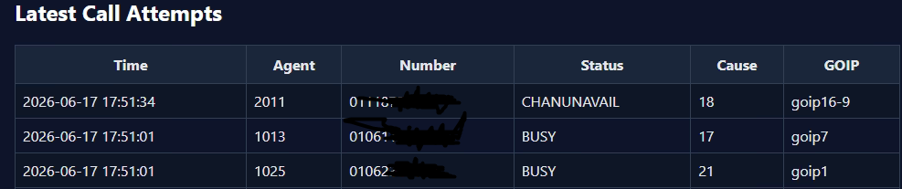
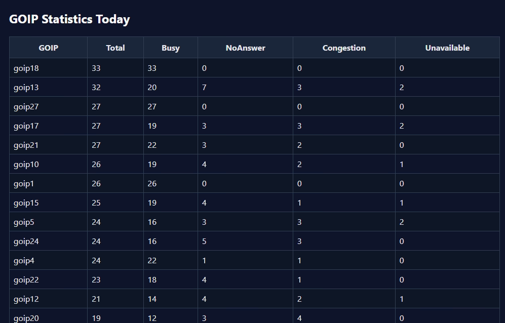
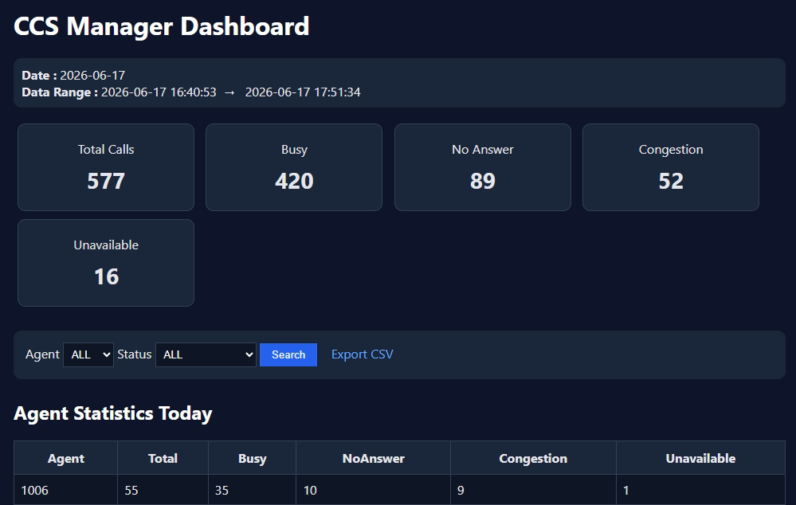

# CCS-CallReport

<p align="center">
  
</p>

<h1 align="center">CCS-CallReport</h1>

<p align="center">
Call Center Reporting & Analytics Solution
<br>
Asterisk | GOIP | MySQL | PHP
</p>

---

## Overview

CCS-CallReport is a lightweight reporting solution designed for outbound call tracking and operational analytics.

The system captures dialing attempts directly from the Asterisk dialplan and stores them inside MySQL, allowing supervisors and engineers to monitor:

* Agent activity
* GOIP utilization
* Dial status distribution
* Daily outbound performance
* Call attempt history

---

## Dashboard Preview



---

## Features

* Agent Statistics
* GOIP Statistics
* Dial Status Summary
* Daily Reporting
* Call Attempt Tracking
* CSV Export
* Web Dashboard
* Prefix 98 Support
* Prefix 30 Support
* Prefix 97 Support

---

## Agent Statistics



The dashboard provides per-agent statistics including:

* Total Calls
* Busy Calls
* No Answer Calls
* Congestion Events
* Unavailable Calls

---

## GOIP Statistics



The dashboard provides per-GOIP metrics including:

* Total Calls
* Busy Calls
* No Answer Calls
* Congestion Calls
* Channel Availability

---

## System Architecture

```text
Agent
  |
  v
Asterisk Dialplan
  |
  v
Call Attempts Table
  |
  +--> Agent Statistics
  |
  +--> GOIP Statistics
  |
  +--> Status Summary
  |
  +--> CSV Export
```

---

## Directory Structure

```text
CCS-CallReport
├── docs
│   └── images
├── sql
├── web
├── install
└── README.md
```

---

## Requirements

* CentOS 6
* Apache
* PHP 5.3
* MySQL
* Asterisk

---

## Installation

### Create Database Objects

```bash
mysql -u root -p your_database < sql/create_database.sql
```

### Create Views

```bash
mysql -u root -p your_database < sql/views.sql
```

### Copy Web Files

```bash
mkdir -p /var/www/html/callreport

cp web/config.php /var/www/html/callreport/
cp web/index.php /var/www/html/callreport/
cp web/export.php /var/www/html/callreport/

chown -R apache:apache /var/www/html/callreport
chmod -R 755 /var/www/html/callreport
```

### Configure Database Credentials

Edit:

```text
web/config.php
```

Update:

```php
$DB_HOST="localhost";
$DB_USER="your_db_user";
$DB_PASS="your_db_password";
$DB_NAME="your_database";
```

### Update Dialplan

Copy the required dialplan logic into:

```text
/etc/asterisk/extensions.conf
```

Reload:

```bash
asterisk -rx "dialplan reload"
```

---

## Validation

### Verify Data Collection

```sql
SELECT COUNT(*) FROM call_attempts;
```

### Verify Status Summary

```sql
SELECT * FROM vw_status_summary_today;
```

### Verify Agent Statistics

```sql
SELECT * FROM vw_agent_summary_today;
```

### Verify GOIP Statistics

```sql
SELECT * FROM vw_goip_summary_today;
```

---

## Supported Dial Prefixes

| Prefix | Description |
| ------ | ----------- |
| 98     | GOIP Pool A |
| 30     | GOIP Pool B |
| 97     | GOIP16      |

---

## Database Objects

### Tables

```text
call_attempts
```

### Views

```text
vw_call_attempts
vw_agent_summary_today
vw_goip_summary_today
vw_status_summary_today
```

---

## Use Cases

* Outbound Call Centers
* GOIP Deployments
* Telecom Monitoring
* Operational Reporting
* Asterisk Analytics

---

## Version

```text
v1.0 Production
```

---

## Author

### Islam Edrees

VoIP Engineer

Specialized in:

* Asterisk
* SIP
* GOIP
* Call Center Platforms
* Linux Administration
* Monitoring & Reporting

GitHub:

https://github.com/IslamEdrees

---


MIT License
